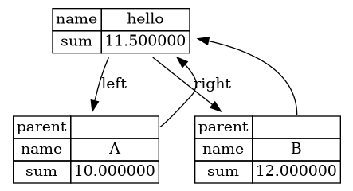

# DSViz

DSViz is a header-only C++11 library for visualization node based data sturcture for generating GraphViz dot files. You can copy and put it anywhere as you like. 

To visualize your data structure, you need to inherit the interface `DSViz::IDataStructure` and implement the dsviz_show method. 

```c++
struct Node : public DSViz::IDataStructure {
    string name;
    float sum;

    Node* parent;
    Node* left;
    Node* right;

    Node(string name, float sum, Node* left, Node* right) 
        : name(name), sum(sum), parent(nullptr), left(left), right(right) {
        if (left)  left->parent  = this;
        if (right) right->parent = this;
    } 

    virtual void dsviz_show(DSViz::IViz& viz) {
        DSViz::TableNode node(viz, 2);
        viz.setName(this, node.name);
        node.addPointer("parent", parent, "", "", "", "[constraint=false]");
        node.add("name", name);
        node.add("sum", sum);
        node.addEdge(left,  "left");
        node.addEdge(right, "right");
    }
};
```

`TableNode` is the class used for printing table node in GraphViz. 
- `addPointer` can set pointer which is another node
- `add` can add a new field
- `addEdge` links nodes 




## Generate a *.dot file for your data structure

Once you have the data structures, create a `Dot` object and load data sturctures using the API `load_ds`. 
Then call `dot.print` will print the GraphViz *.dot format in string format. You can output it to file or print into stdout.

```c++
    Node A {string("A"), 10.0f, nullptr, nullptr};
    Node B {string("B"), 12.0f, nullptr, nullptr};
    Node hello {string("hello"), 11.5f, &A, &B};

    DSViz::Dot dot;
    dot.load_ds(&hello);
    std::cout << dot.print();
```

You can use `xdot` in linux to open the graphviz dot file or using `dot` to convert it into a png image:

```
  dot -Tpng filename.dot -o outfile.png
```


