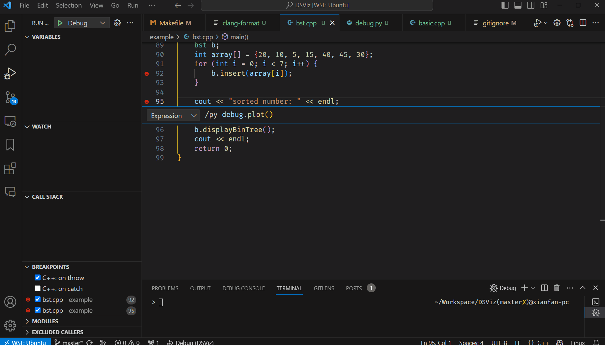
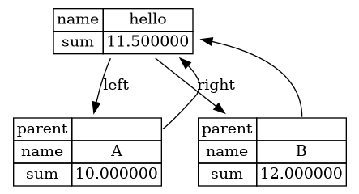

How to Debug Data Structure with DSViz and CodeLLDB
===================================================

This is a recent workflow for me to debug a data structure with DSViz and CodeLLDB plugin on VSCode. It is a bit complicated, but it is worth it. 
This is inspired by the excellent tutorial on [data visualization in codelldb](https://github.com/vadimcn/codelldb/wiki/Data-visualization). It is a great tool for debugging C++ code. So I hope it can be used to debug data structure as well.




## A Simple Example - BST (Binary Search Tree)

Let's start with a simple example - BST. The code is in [bst.cpp](../example/bst.cpp). This BST is implemented with a struct `bintree_node` and a host class `bst`. Usually, we want to visualize the data structure starting from the root node and then show the whole tree structure. 

```c++
struct bintree_node {
    bintree_node *left;
    bintree_node *right;
    int           data;
};

class bst {
    bintree_node *root;

  public:
    bst() { root = NULL; }
    int  isempty() { return (root == NULL); }
    bintree_node *getRoot() { return root; }
    void insert(int item);
    void displayBinTree();
    void printBinTree(bintree_node *);
};
```

We may want to check the data structure after each insertion. So we need to add some breakpoints in the `main` function where it calls the `insert` function and where it finished insertion. 

```c++
    bst b;
    int array[] = {20, 10, 5, 15, 40, 45, 30};
    for (int i = 0; i < 7; i++) {
        b.insert(array[i]);  // <-- add a breakpoint here
    }

    cout << "sorted number: " << endl; // <-- add a breakpoint here
    b.displayBinTree();
    cout << endl;
```

We want something that can show the BST while we are debugging. Print to the graphviz format is a good choice.


## Print to Graphviz Format

This project `DSViz` is a library I made to print data structure to graphviz format. It is a header-only library. You can just copy the [dsv.hpp](../dsv.hpp) to your project.

It provides a friendly interface to visualize the data structure. For a non-invasive API, it can be used to access and print data structure without modifying the original code. 

This is a function we need to write to print the BST, `P` is the pointer of the node, `viz` is the interface for adding nodes and edges.

```c++
void dsviz_show(bintree_node* P, DSViz::IViz &viz);
```

Since we don't want to modify the original code, we need to define a mock class that uses this function. `DSViz::Mock` is a template that has two parameters: the type of the node and a function for visualization:

```c++
typedef DSViz::Mock<bintree_node, dsviz_show> mock;
```
Now, we can use `mock::get` to convert a pointer of the original node to the mocked node. It should be used everywhere in the `dsviz_show` function:

```c++
void dsviz_show(bintree_node* P, DSViz::IViz &viz) {
    DSViz::TableNode node(viz);
    viz.setName(mock::get(P), node.name);
    node.add("data", P->data);
    if (P->left) node.addEdge(mock::get(P->left), "left");
    if (P->right) node.addEdge(mock::get(P->right), "right");
}
```

`TableNode` is a class for printing a table in the graphviz node. You can set name and add attributes to it. It will print something like the follow figure in the final graphviz file:



`addEdge` method will add an edge from the current node to the target node. The second parameter is the label of the edge. So it will be converted to the following graphviz code:

```dot
    node1 -> node2 [label="left"];
```

Then, you can print the graphviz file with the following code:

```c++
    auto* root = mock::get(b.getRoot());
    DSViz::Dot dot;
    dot.load_ds(root);
    string str = dot.print();
```

The best feature of `DSViz` is that you don't need to change any line of the original code, all those parts could be around with some `#ifdef` macros. So you can use the original code for production and use this code for debugging. 


## Debug with CodeLLDB

Now we can use the graphviz file to visualize the data structure. But we want to see the graphviz file while debugging. This is where CodeLLDB comes in. It is a plugin for VSCode that provides a great debugging experience for C++ code. First, we need an API to print the graphviz file to the debugger. 

```c++
const char* _dotToDebugger(bst& b) {
    if (!b.getRoot()) return "";
    
    auto* root = mock::get(b.getRoot());
    DSViz::Dot dot;
    dot.load_ds(root);
    string str = dot.print();

    static char cstr[1024 * 16];
    strcpy(cstr, str.c_str());
    return cstr;
}
```

Here we use a static buffer to store the string, so the debugger can easily access it. (Return a std::string directly will not work)

Then we want to recieve it in the lldb. We need to write a python script to do this. I put it in [debug.py](../example/debug.py) as a reference for you. 

First, get the debugger instance, when it is initialized, `__lldb_init_module` function will be called. 

```python
import lldb
import debugger
import json
import re

mydebugger = None

def __lldb_init_module(debugger, internal_dict):
    print("__lldb_init_module")
    global mydebugger
    mydebugger = debugger
```

Then we need to get the C string from the evaluation of an lldb expression - for example, `_dotToDebugger(b)` will give you the graphviz string. Maybe `b` should not be hardcoded here, I do that for simplicity. You can follow the way in [data visualization tutorial](https://github.com/vadimcn/codelldb/wiki/Data-visualization) to get the pointer of the node and then get the graphviz string by calling `_dotToDebugger`.

`GetSelectedTarget().GetProcess().GetSelectedThread().GetSelectedFrame()` will give you the current frame. Then you can evaluate the expression in the current frame by calling `EvaluateExpression`. Use `ReadCStringFromMemory` to get the C string from the result.

```python
def get_result(exp):
    frame = mydebugger.GetSelectedTarget().GetProcess()
            .GetSelectedThread().GetSelectedFrame()
    options = lldb.SBExpressionOptions()
    result = frame.EvaluateExpression(exp, options)
    cstring = mydebugger.GetSelectedTarget().GetProcess()
        .ReadCStringFromMemory(
            result.GetValueAsUnsigned(), 1024 * 16, lldb.SBError())
    return cstring
```

Finally, we want a html page to show the graphviz figure. We can use the following code to display it side by side with your code in the VSCode. 

```python
    debugger.display_html(document, position=2)
```

Here I used a js library [viz.js](https://github.com/mdaines/viz-js) to show it.

```html
<html>
    <head>
        <script src="https://unpkg.com/@viz-js/viz@3.2.3/lib/viz-standalone.js"></script>
        <script>
            function render() {
                var node = document.getElementById("dot");
                var data = node.textContent;
                node.parentNode.removeChild(node);
                console.log(data);
                Viz.instance().then(function(viz) {
                    var svg = viz.renderSVGElement(data);
                    document.getElementById("graph").appendChild(svg);
                }).catch(error => {
                    console.error(error);
                });
            }
        </script>
    </head>
    <body onLoad='render()'>
        <div id="graph"></div>
        <xmp id="dot">
        </xmp>
    </body>
</html>
```

There is a special tag `<xmp>` in html, it will not escape the html code or any special symbol inside it. So we can put the graphviz string in it. 

```python
document = """ .... <xmp id="dot">""" + graphviz + """</xmp> ... """
```

Finally, after we do all the things above, we can use the following command to start the debugging. The most important thing is `initCommands` in it. We need to load the python script into lldb. 

```
"configurations": [
    {
        "type": "lldb",
        "request": "launch",
        "name": "Debug",
        "program": "${workspaceFolder}/bin/bst",
        "args": [],
        "cwd": "${workspaceFolder}",
        "initCommands": [
            "command script import ${workspaceFolder}/example/debug.py"
        ]
    }
]
```

You can set a breakpoint in the `main` function and start debugging using the following format in the conditional breakpoint setup (right click on the breakpoint and select `edit breakpoint...`, then type `enter`):

```
/py debug.plot()
```


If everything goes well, you will see the graphviz figure in the VSCode while debugging.


If you are interested in this approach. Please clone [this repo](https://github.com/sunxfancy/DSViz) and play on a local machine. You will find it is quite powerful in debugging.

